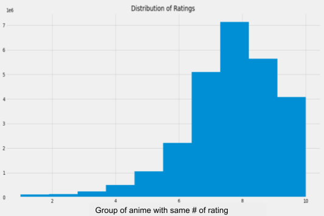
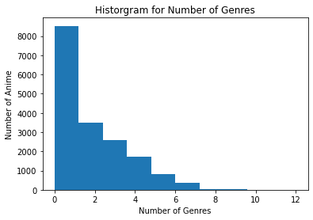
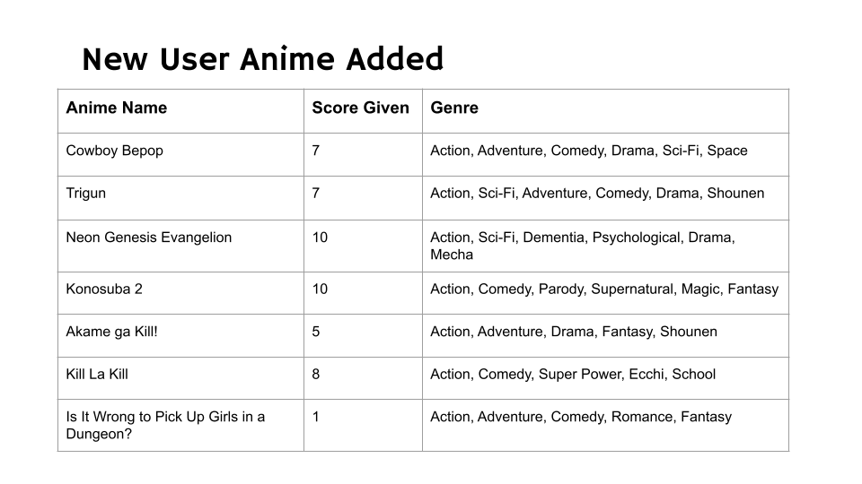

# MyAnimeList Recommendation


## Overview

My Anime List (MAL) is a fan-based website where users can track and rate the anime or manga that they watch. MAL contains a lot of details about anime and mange as well as reviews and ratings from almost half a million users. With all this information, MAL has a global ranking of anime/manga, a recommendation system based on users preferences, and directs users to where they can watch or read a given anime/manga.

## Business Problem

Since MAL is a fan-based website, we have been tasked to develope a more effective recommendation system using our expertise in machine learning. 

## Data

Our dataset is made available by Kaggle.

**Note**: the dataset is too large to be uploaded on github.  
Here are steps to acquire the dataset in order to make our codes work:
- Download the data from Kaggle. Click this [link](https://www.kaggle.com/hernan4444/anime-recommendation-database-2020). The files that we will be using are "anime.csv" and "animelist.csv".
- Create a folder called "data" and place the files in it.
- Make sure that the paths for the files look like this: "data/anime.csv" and "data/animelist.csv".

The dataset was scraped directly from My Anime List in March 2021. It contains over 109 million reviews from over 325000 users with approximately above 17000 anime titles. The rating reviews score between 1-5 stars (5 is the best) with is translated to 10 points scale. The metadata also contains key features such as Genre, Popularity, English name, and Score.

## EDA

The distribution of rating. The graph is left-skewed showing that people trend to rate more on high rating anime. 



The complexity of the data can be seen by looking at the graph showing that a number of anime has multiple genres. 


## Methodology

We begin our methodology with filtering data down to more manageable size. We remove unrelated and unsavory genres such as 'Musical', 'Movie','OVA', 'Special', 'ONA', and 'Hentai.' We choose to build our recommendation system using collaborative filtering algorithm. There are two libraries that provide useful built-in machine learning models: ALS from PySpark; SVD from Surprise. These are two models that we rely on heavily.  


## Results

From ALS model, RMSE is around 5.6.
From SVD model, RMSE is around 3.1, which is better judging by the number.

# Example of results from SVD model:
We add a new user which some preference.


Here are 5 examples out of the total 10 recommended anime.
1. Code Geass: Hangyaku no Lelouch R2
2. Major S6
3. Death Note
4. One Punch Man
5. Black Lagoon: The Second Barrage

From 10 recommended results, we have found that 4 of them are already seen and liked; 2 of them are recommended by other services; 1 is new but recommended by friends; and 3 of them are never heard but promising.

## Conclusions

- SVD model does the best job with 3.1 RMSE.
- We are satisfied with the results so far.

## Next Steps

In order to improve results, we might need to break down the data even more. Some anime in the dataset has multiple seasons. Combining them might give a better RMSE score. 
 
## For More Information

See full analysis in [Jupyter Notebook](./phase_4_code.ipynb) or check out this [presentation](./phase_4_slidedeck.pdf). 
For additional info, please contact:  
Ramil Chaimongkolbutr at [ramil.ming@flatironschool.com](mailto:ramil.ming@flatironschool.com)  
George Ferre at [georgeaferre@flatironschool.com](mailto:georgeaferre@flatironschool.com)  
Aaron Cherry at [cherrya050@flatironschool.com](mailto:cherrya050@flatironschool.com)


## Repository Structure

```
├── data
├── imgs
├── notebooks
├── README.md
├── phase_4_slidedeck.pdf
└── phase_4_code.ipynb
```
